# New Sneaker Designs Generation from Existing Design Data
Implementing VAE to learn from existing popular sneaker designs for the fashion patterns, generating new novel shoe design candidates.

## Collaborators
- Ethan Wang
- Steven Si
- Runyu Yang
- Danqing Chen
- Wenbo Zhao

**Web App**: [http://dfuaix9nq1.com/](http://dfuaix9nq1.com/)

This repository presents a full notebook-driven workflow for sneaker image generation using a Beta-VAE model, from preprocessing to interactive custom design.

## Notebook Navigation

1. [01 - Data Preprocessing](#01---data-preprocessing)
2. [02 - Baseline Training (MSE + Fixed Beta)](#02---baseline-training-mse--fixed-beta)
3. [03 - Improved Training (BCE + KL Annealing)](#03---improved-training-bce--kl-annealing)
4. [04 - Latent Analysis with Rich Visualizations](#04---latent-analysis-with-rich-visualizations)
5. [05 - Interactive Custom Sneaker Design](#05---interactive-custom-sneaker-design)

---

## 01 - Data Preprocessing

**Notebook**: `notebooks/01_data_preprocessing.ipynb`

### Goal
Convert raw sneaker images into a clean model-ready dataset (`64 x 64`, RGB, white background, square format), while preserving brand/class folder structure.

### Workflow Summary
- Read original raw images recursively.
- Convert each image to RGB.
- Apply center padding to square white canvas.
- Resize to `64 x 64`.
- Save processed output under the unified data directory.

### Key Result
**[Content to be added here.]**

---

## 02 - Baseline Training (Beta-VAE)

**Notebook**: `notebooks/02_baseline_training.ipynb`

## The Philosophy of Generative Models

For many modalities, the data we observe is determined by unseen abstract variables, denoted as latent variable $z$. The best intuition for this is **Plato’s Allegory of the Cave**: prisoners see only 2D shadows (our observed data, like images of sneakers) cast by unseen 3D objects (the latent variables, like color, shape, and size). While we cannot directly observe these hidden factors, generative models allow us to infer and approximate them. 

**The Compression Caveat:** Unlike the allegory where the true objects are higher-dimensional, in generative modeling, we aim to learn *lower-dimensional* latent representations. This acts as a powerful form of compression, filtering out noise to uncover the true, semantically meaningful structure underlying the observations.


## VAE vs. $\beta$-VAE: Achieving Controlled Generation

To understand our architectural choices, we must look at the optimization objectives of Variational Autoencoders (VAEs).

### 1. The Standard VAE & Feature Entanglement
A standard VAE optimizes the Evidence Lower Bound (ELBO), which balances two losses:

$$\mathcal{L} = \text{Reconstruction Loss} + D_{KL}(q_\phi(z|x) || p(z))$$

- **Reconstruction Loss:** Ensures the generated image closely resembles the input.
- **KL Divergence:** Regularizes the latent space to approximate a standard normal distribution.

**The Problem:** In a standard VAE, to perfectly minimize reconstruction error, the model often takes shortcuts. It mixes different attributes (e.g., shoe color, sole thickness, ankle height) together across the latent dimensions. This is known as **Feature Entanglement**. If you try to modify the shoe color, the model might accidentally change it from a low-top to a high-top.

### 2. The $\beta$-VAE Improvement
$\beta$-VAE introduces a simple but highly effective hyperparameter, $\beta$, to heavily penalize the KL divergence term:

$$\mathcal{L} = \text{Reconstruction Loss} + \beta \cdot D_{KL}(q_\phi(z|x) || p(z))$$

By setting $\beta > 1$ (e.g., $\beta = 2.0$ in our final model), we impose a strict **Information Bottleneck**. 

### 3. Why This Excels at Sneaker Design
The heavy KL penalty forces the posterior distribution to closely match the prior (a standard normal distribution with a diagonal covariance matrix). To survive this bottleneck and still reconstruct the image successfully, the model *must* discover statistically independent generative factors. 

It naturally **disentangles** the features. Instead of a messy, tangled latent space, $\beta$-VAE organizes the data into an independent, human-interpretable control console. Based on our latent traversal experiments, this means:
- **Dim 8** independently controls the geometric shape (low-top vs. high-top).
- **Dim 9** independently controls the main body color.
- **Dim 4 & 5** independently control the sole details.

Ultimately, $\beta$-VAE transforms a standard random image generator into a **precise, controllable design tool**.

### Training Output
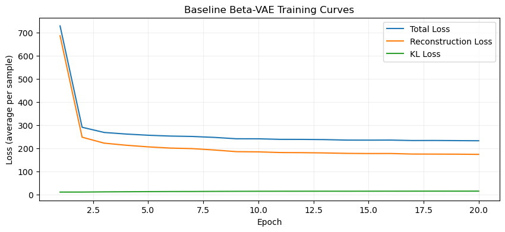


---

## 03 - Improved Training (BCE + KL Annealing)

**Notebook**: `notebooks/03_improved_training_with_annealing.ipynb`

### Goal
Improve generation quality and latent behavior using:
- BCE reconstruction loss
- KL annealing schedule (dynamic beta)

### What Changed vs Baseline (Three Core Differences)

1. **Initialization from the baseline model**
- The improved model is trained by loading the baseline checkpoint first, instead of starting from random weights.
- This means Stage 2 training starts from a model that already reconstructs sneaker structure reasonably well.
- Practical effect: faster convergence and more stable improvement.

2. **KL annealing (dynamic beta in ELBO)**
- **a) ELBO and what beta means**
  - VAE objective (minimized as loss):
```text
𝓛 = 𝓛_recon + β · D_KL(q_φ(z|x) || p(z))
```
  - Here, $\beta$ controls the strength of latent regularization:
  - Larger $\beta$ enforces a more organized latent space, but can hurt reconstruction quality.
- **b) How we implemented it**
  - Instead of using a fixed $\beta$ from epoch 1, we linearly increase $\beta$ from `0` to `2.0` during the first `10` epochs, then keep it at `2.0`.
  - This is the `KL annealing` schedule used in Notebook 03.
- **c) Why this helps**
  - Early epochs focus more on reconstruction (easier optimization).
  - Later epochs gradually enforce latent regularization.
  - Net result: better balance between visual quality and latent controllability.

3. **BCE reconstruction loss instead of MSE**
- **a) BCE vs MSE**
  - **MSE** penalizes squared pixel distance and often favors smoother outputs.
  - **BCE** treats normalized pixels as probabilities and penalizes mismatch with cross-entropy.
- **b) Why BCE can be better here**
  - For normalized shoe images in `[0, 1]` with sigmoid output, BCE typically preserves local contrast and edge sharpness better.
  - Practical effect in this project: cleaner contours and visually sharper sneaker details.

### Training Output
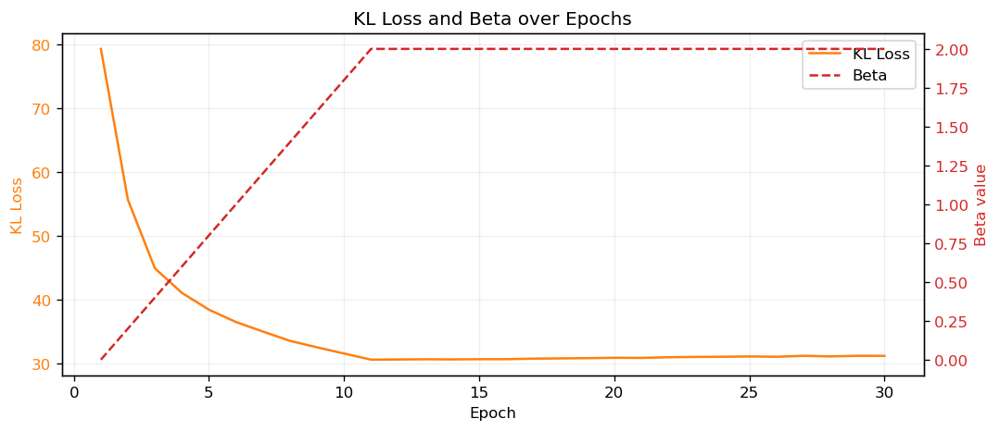

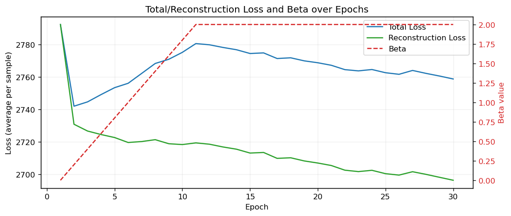

### Observations
- The first figure isolates **KL Loss + Beta**, making annealing behavior easy to explain.
- The second figure focuses on **Total/Reconstruction Loss + Beta**, showing optimization trend without KL scale compression.
- Together, these plots show both optimization stability and regularization progression.

---

## 04 - Latent Analysis with Rich Visualizations

**Notebook**: `notebooks/04_latent_analysis_rich_visualization.ipynb`

### Goal
Analyze what each latent dimension learns and how controllable the generator is.

### Visual Results

#### Reconstruction Quality (Input vs Reconstruction)
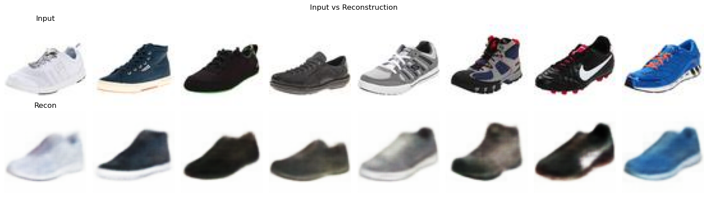

#### Latent Traversal Grid
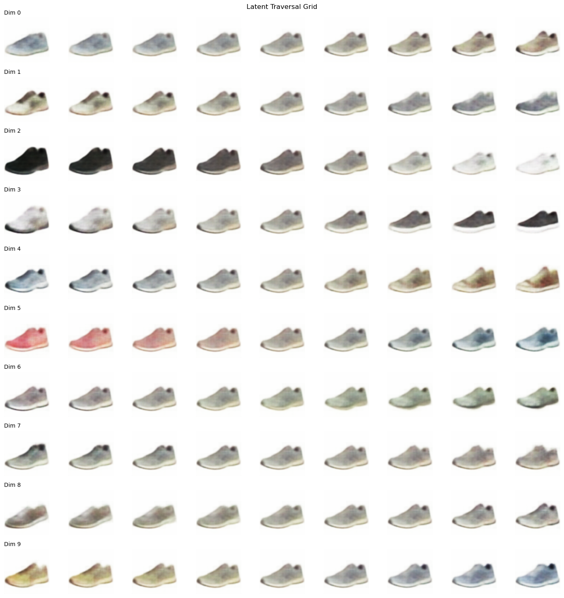

#### Latent Mean Distribution
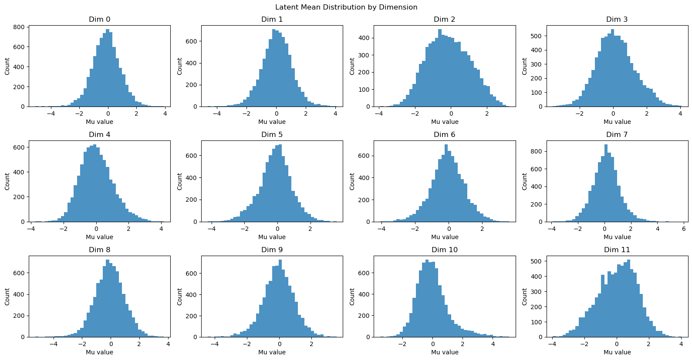

#### Latent Correlation Heatmap
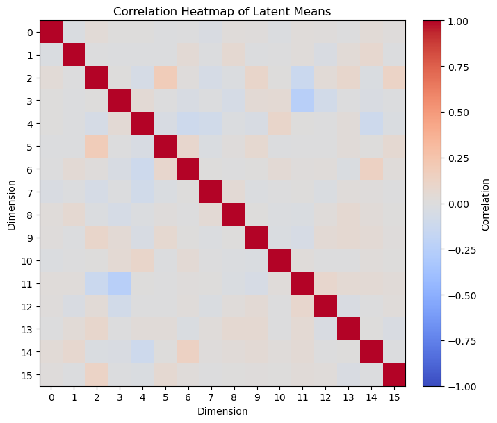

#### KL Contribution per Dimension
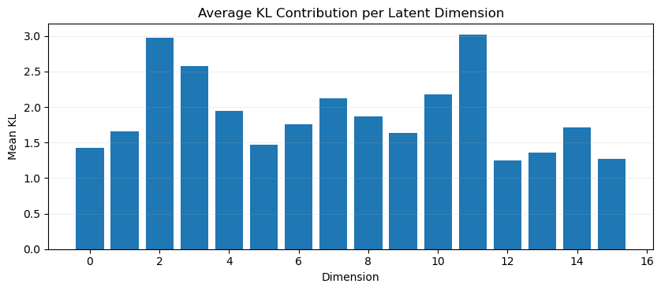

#### Dimension Impact Bar
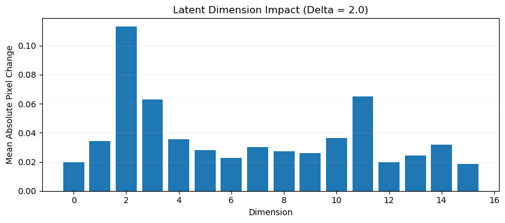

#### Random Prior Samples
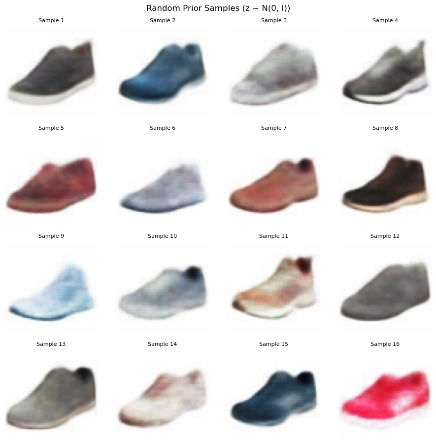

#### Latent Interpolation
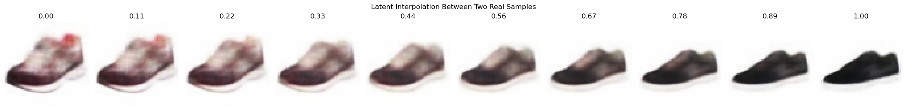

### Insights
**[Content to be added here.]**

---

## 05 - Interactive Custom Sneaker Design

**Notebook**: `notebooks/05_custom_design_interactive.ipynb`  
**Web App**: [http://dfuaix9nq1.com/](http://dfuaix9nq1.com/)

### Goal
Provide direct user control over latent dimensions (`Dim0` to `Dim15`) to generate custom sneaker designs interactively.

### Features
- Slider + numeric input for each latent dimension.
- One-click generation.
- Reset / randomize options.
- HTML deployment with backend model inference.

### Example Generated Design
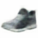

### Demo Notes
**[Content to be added here.]**

---

## Project Conclusion

- End-to-end pipeline is fully notebook-based.
- Model is trained, analyzed, and deployed to a live interactive website.
- The system supports both research-style latent inspection and practical controllable design generation.

### Final Reflection
**[Content to be added here.]**
