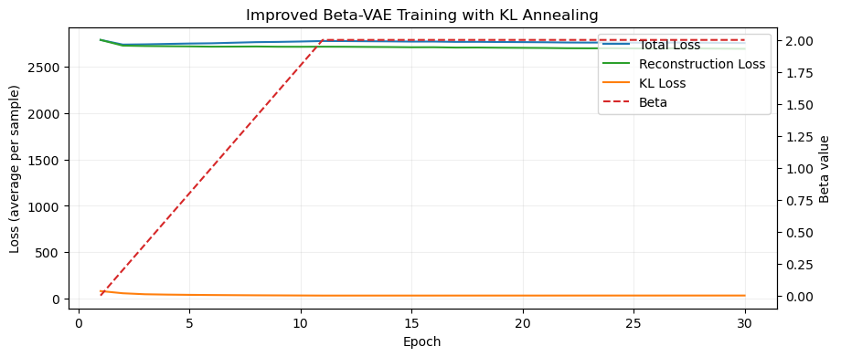

# New Sneaker Designs Generation from Existing Design Data

**Live Demo Website**: [http://dfuaix9nq1.com/](http://dfuaix9nq1.com/)

This repository presents a full notebook-driven workflow for sneaker image generation using a Beta-VAE model, from preprocessing to interactive custom design.

## Notebook Navigation

1. [01 - Data Preprocessing](#01---data-preprocessing)
2. [02 - Baseline Training (MSE + Fixed Beta)](#02---baseline-training-mse--fixed-beta)
3. [03 - Improved Training (BCE + KL Annealing)](#03---improved-training-bce--kl-annealing)
4. [04 - Latent Analysis with Rich Visualizations](#04---latent-analysis-with-rich-visualizations)
5. [05 - Interactive Custom Sneaker Design](#05---interactive-custom-sneaker-design)

---

## 01 - Data Preprocessing

**Notebook**: `notebooks/01_data_preprocessing.ipynb`

### Goal
Convert raw sneaker images into a clean model-ready dataset (`64 x 64`, RGB, white background, square format), while preserving brand/class folder structure.

### Workflow Summary
- Read original raw images recursively.
- Convert each image to RGB.
- Apply center padding to square white canvas.
- Resize to `64 x 64`.
- Save processed output under the unified data directory.

### Key Result
**[Content to be added here.]**

---

## 02 - Baseline Training (MSE + Fixed Beta)

**Notebook**: `notebooks/02_baseline_training.ipynb`

### Goal
Train the first Beta-VAE baseline using:
- MSE reconstruction loss
- Fixed beta regularization

### Training Output

### Observations
**[Content to be added here.]**

---

## 03 - Improved Training (BCE + KL Annealing)

**Notebook**: `notebooks/03_improved_training_with_annealing.ipynb`

### Goal
Improve generation quality and latent behavior using:
- BCE reconstruction loss
- KL annealing schedule (dynamic beta)

### Training Output

### Observations
**[Content to be added here.]**

---

## 04 - Latent Analysis with Rich Visualizations

**Notebook**: `notebooks/04_latent_analysis_rich_visualization.ipynb`

### Goal
Analyze what each latent dimension learns and how controllable the generator is.

### Visual Results

#### Reconstruction Quality (Input vs Reconstruction)

#### Latent Traversal Grid

#### Latent Mean Distribution

#### Latent Correlation Heatmap

#### KL Contribution per Dimension

#### Dimension Impact Bar

#### Random Prior Samples

#### Latent Interpolation

### Insights
**[Content to be added here.]**

---

## 05 - Interactive Custom Sneaker Design

**Notebook**: `notebooks/05_custom_design_interactive.ipynb`  
**Web App**: [http://dfuaix9nq1.com/](http://dfuaix9nq1.com/)

### Goal
Provide direct user control over latent dimensions (`Dim0` to `Dim15`) to generate custom sneaker designs interactively.

### Features
- Slider + numeric input for each latent dimension.
- One-click generation.
- Reset / randomize options.
- HTML deployment with backend model inference.

### Example Generated Design

### Demo Notes
**[Content to be added here.]**

---

## Project Conclusion

- End-to-end pipeline is fully notebook-based.
- Model is trained, analyzed, and deployed to a live interactive website.
- The system supports both research-style latent inspection and practical controllable design generation.

### Final Reflection
**[Content to be added here.]**
